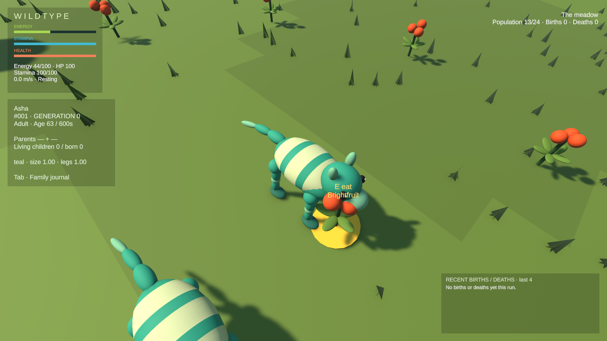
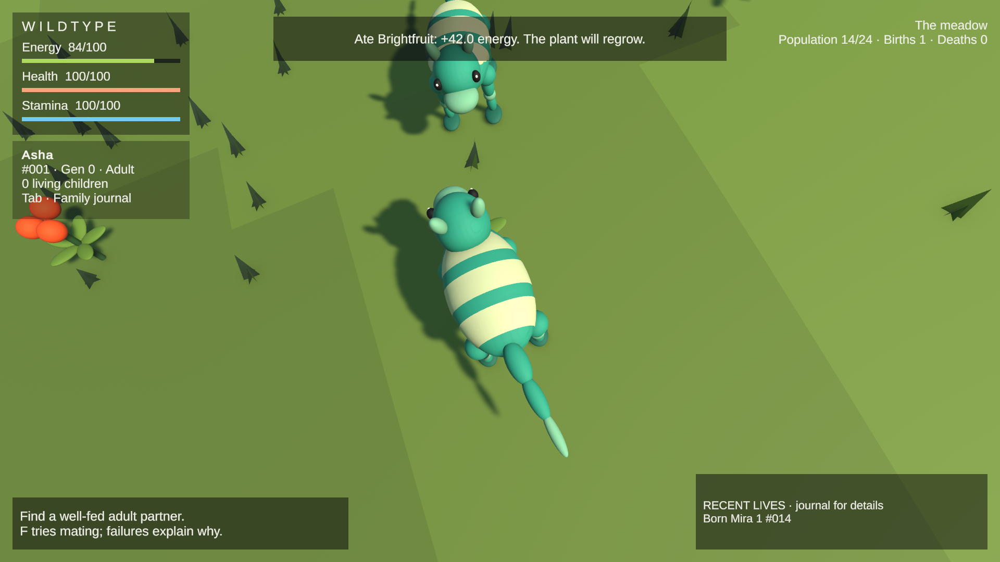
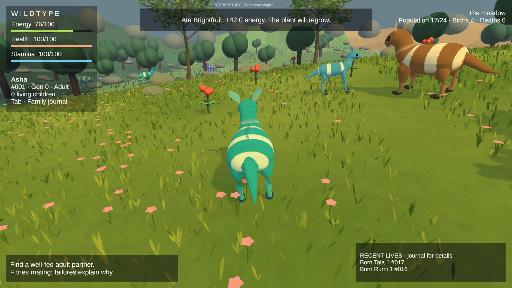
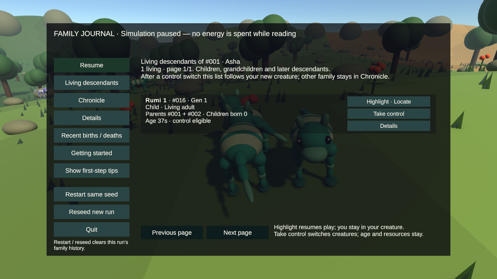
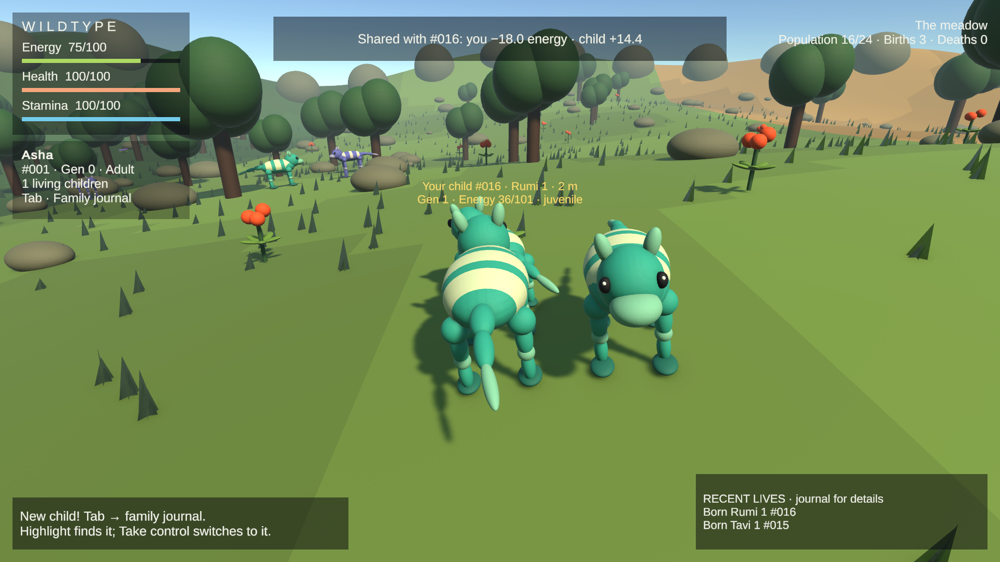
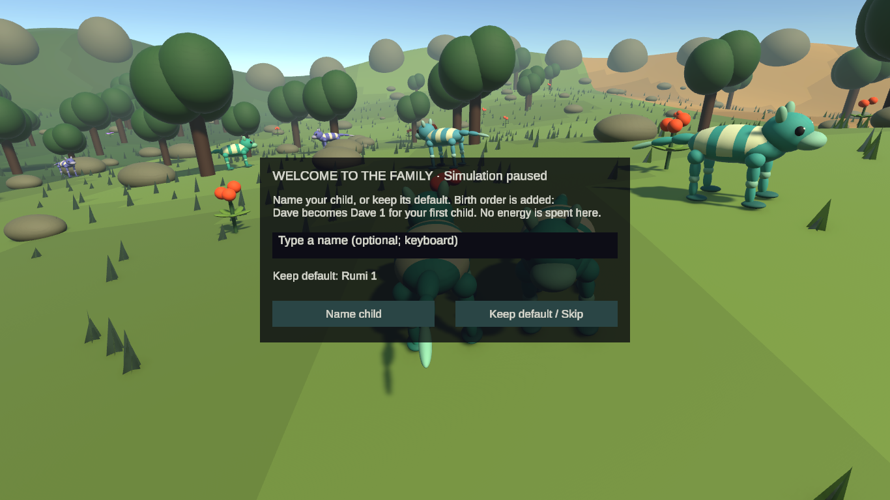
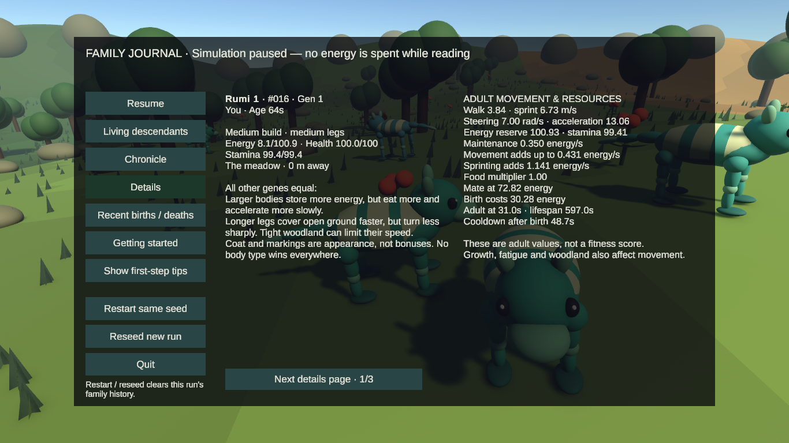
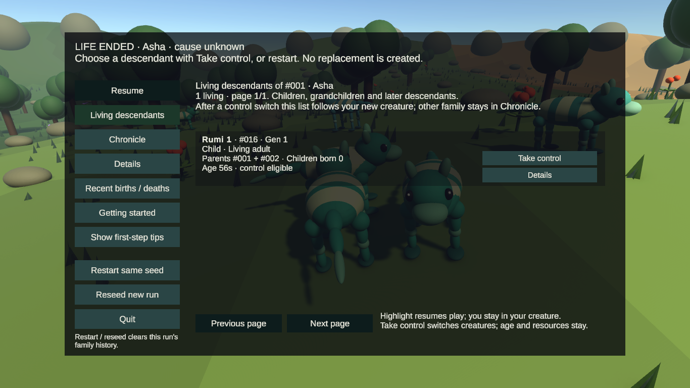
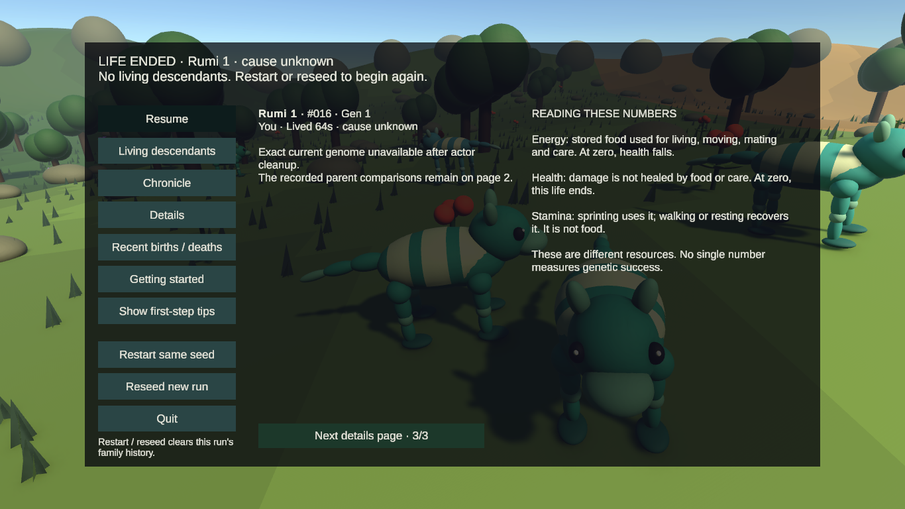
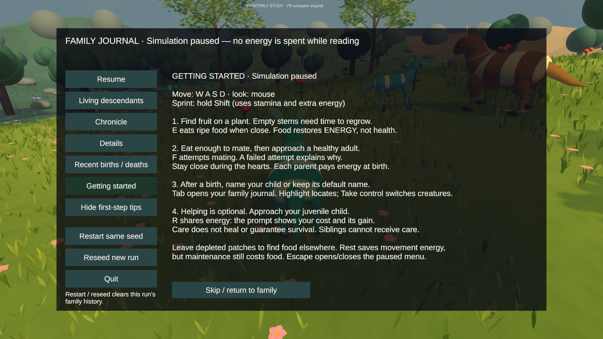

# Gameplay clarity and readable stats

## Scope and protected work

Started from local and pushed `milestone-painterly-prototype` at `168d0f04daae5b78f71c0709ff09c2c4bc207a51`. Work is on `milestone-gameplay-clarity`; `main` stays at `d768797775ad0a7b802eaec0f50899e5d3e2e0df`. No merge, history rewrite or force-push.

The five pre-existing dirty files were copied byte-for-byte to `%TEMP%/WildTypeClarity-24342993` before implementation. The original scene's unresolved sun-component removal is **not** part of this change. Neither the scene nor the four other local assets is staged. The existing painterly scene/materials/meshes, genetics, phenotype formulas, ecology, reproduction costs, care transfer rules, ancestry/caps and zoom are unchanged. No RunAudit, packages, assets or services were added.

## What changed

- Ordinary HUD: three clearly labeled Energy/Health/Stamina values and bars; a compact name/ID/generation/child-count panel; readable hungry/starving, low-health and tired messages only when relevant. Stronger translucent backing protects urgent text against bright scenery. Raw size/leg coefficients and expanded parent comparisons are no longer over ordinary play.
- Food prompts identify the plant and quote the clamped nutrition gain. A failed meal explains full energy, missing ripe food, regrowth or distance. Successful meals explicitly restore energy, not health. A successful-meal counter drives only the optional tutorial step.
- Mating failure wording uses the existing eligibility result and suggests an applicable next step. A ready prompt shows the controlled parent's actual energy charge at birth. Care previews call the same transfer calculation as the action, including reserve/capacity/efficiency limits; the existing care rejection messages remain authoritative.
- Paused journal: three spacious cards/page, names and truthful relationships first, IDs/generations retained, separate **Highlight · Locate**, **Take control**, and **Details** buttons. Card text is no longer a hidden control-transfer button. The header explains whose descendants are shown and where earlier branches remain. Siblings remain highlight-only, never eligible for descendant control or direct-child care.
- Details: current resources/location, plain-language inherited tradeoffs, precise adult values, all exact genes, recorded parent comparisons and all retained notable mutation records. Additional mutation pages handle the existing configurable record cap. Missing actors do not acquire invented current stats or death ages. Deceased records retain their actual cause/age.
- Optional first-step tips teach moving, ripe food, eating, mating, and returning to the journal after a birth. They can be hidden/replayed; **Getting started** remains accessible from the menu. Journal, guide and naming explicitly say simulation is paused. There is no mandatory tutorial, new resource, or permanent controls legend.
- Recent ordinary-play history shows two compact events; all four existing records with generation/parents/lineage/cause remain in the paused **Recent births / deaths** view. Cumulative Population/Births/Deaths remain visible in play.
- Keyboard/gamepad bindings are unchanged. Explicit button navigation handles paging and disabled actions. E now has the same frame/held-key guarded Game-view fallback already used by F/R/Tab/Escape, because short native E taps were reproducibly missed by the Editor's Input System routing. No energy or interaction rules changed.

## Verification method

Computer-use native input inspected the actual saved original and painterly scenes. This is agent-assisted rendered inspection, **not human usability testing**. A temporary Editor helper opened existing scene assets without saving them, positioned actors near food/partners/children, refilled/spent energy to expose prompts, froze AI for bounded checks, and captured the actual Game view. Any forced death used ordinary fatal damage and remained `cause unknown`; fixture starvation with frozen AI is not ecological-balance evidence. The helper and its `.meta` are removed before final full suites.

Baseline: actual F input completed courtship/birth and opened the old naming modal. The old journal used a smaller translucent reading area, ordinary play showed raw coefficients, and a creature card implicitly transferred control. Native E taps did not register reliably. No rule tuning was inferred from that input-routing failure or fixture deaths.

### Native rendered observations

| Path | Actual observation | Assistance / limit |
|---|---|---|
| Original scene, meal | Native E consumed Bright fruit; notice reported +42.0 energy. Food prompt and three resource labels were readable at 1920×1080. | Helper moved the player beside ripe food and reduced energy. Not an unassisted search for a meal. |
| Mating / birth | Native F at low energy said **Need 72.0 energy to mate — eat ripe fruit first**. Later F started hearts and produced Rumi 1 #016, Gen 1, parents #001/#002. | Partner positioning and energy were assisted. One immediate retry correctly reported a remaining one-second cooldown. Ordinary birth/courtship code ran. |
| Naming | Paused newborn modal inspected at 1920×1080 and 1366×768. Native Keep default retained Rumi 1. | Did not type a custom name in this pass; existing naming regression tests remain. |
| Care | Native R succeeded with **18.0 energy spent / 14.4 gained**, with the child's energy visible. | Helper positioned the child and reduced its energy. An earlier attempt correctly failed after the child grew into an adult while inspection was in progress. No survival guarantee inferred. |
| Family / Locate | Native journal click on Highlight resumed play and showed the selected #016 gold cue while controller remained #001. Separate Take control button was visible. | Birth setup assisted; actual UI clicks and pulse rendered. Sibling and multiple-page eligibility are automated regression checks in this pass, not a new natural multi-generation session. |
| Death / continuation | Fatal damage opened a **cause unknown** death choice; native Take control continued as #016 with its existing age/resources and hungry warning. Its Living descendants scope then showed zero children. A second fatal damage showed **No living descendants. Restart or reseed to begin again.** | Both deaths deliberately assisted; neither is evidence of natural starvation or lifespan balance. |
| Details / restart | Native clicks visited all three Details pages at 1366×768. Restart same seed reset population to 13, births/deaths to zero and first-step tips. | Reseed and pause accounting tested automatically. |
| Painterly scene | Native E again consumed Bright fruit for +42.0 energy. Native F6 switched to the original appearance and back without restarting. Tab and Getting started opened the paused guide at 1920×1080. | Food positioning/resource setup assisted. Did not repeat the complete birth/care/death sequence in this scene. |

Actual rendered sizes were **1920×1080 and 1366×768**. The smaller original-scene journal, Details, naming, care quote and both death states were inspected. Automated rectangle/text-fit checks additionally cover 1280×720; that is not a rendered 1280×720 inspection. Button labels distinguish actions without color alone. Gamepad navigation uses virtual-device tests; no physical controller was exercised. The normal HUD is hidden while reading paused views.

The inspection helper once encountered a file-sharing error while its request file was being updated; this was a tooling error, not a gameplay exception. The helper was removed before final tests. The final painterly Editor session had no Console errors or warnings. Temporary captures/fixtures were not saved into either scene.

### Automated results

Final complete suites after removing the temporary helper: **129/129 Edit Mode passed** (0.25 seconds of test execution) and **44/44 Play Mode passed** (510.89 seconds), **zero failed or skipped**. Unity 6000.4.7f1, existing Test Framework, saved project. Test durations exclude Editor startup/import. The existing bounded 1,200-second ecology regression observed 52 births, 41 deaths (40 old age, one starvation), 24 living at finish/peak, 26 actor objects and 65 archive records, reaching generation 11. Those are one regression run's observations, not evidence that this presentation pass changed balance or improved a genotype.

New coverage comprises ten Edit Mode cases and four Play Mode cases: truthful statuses, unchanged exact genes, keyboard/gamepad guide content, mutation wording, food failures, exact care accounting, mating messages, guide pause, first tips/restart/reseed, virtual gamepad navigation, separate relationship/action eligibility, unavailable death causes, bounded text/layout, and held-input guarding. Existing relevant suites retain genetics, ecological behavior, naming, Locate, descendant control, care, painterly comparison and 24-living/32-object/72-food/512-ancestry checks.

An initial complete Play run passed 40/44. Failures exposed two obsolete test selectors/expectations after replacing the clickable card and reducing the turnover summary, a same-frame focus transition in the new fixture, and an overlong gamepad first-step tip. Corrected the selectors/fixture, shortened the actual tip, and passed the focused reruns before the final full suites. Earlier focused layout testing also found and corrected the footer height. These intermediate failures are not hidden by the final results.

### Protected local files

All five original SHA-256 hashes match the pre-task backup and the prior protected-assets inventory. All remain uncommitted and excluded from staging:

| Path under Assets/WildType | Final status |
|---|---|
| Scenes/CreatureStage_Prototype.unity | Byte-identical; protected sun-component change untouched |
| Materials/Interaction gold.mat | Byte-identical |
| ScriptableObjects/Amber Bulwark.asset | Byte-identical |
| ScriptableObjects/Meadow Grazer.asset | Byte-identical |
| ScriptableObjects/Violet Strider.asset | Byte-identical |

No saved scene, prefab, procedural mesh, renderer setting or gameplay configuration is included in this clarity commit. Rendered evidence uses the preserved local assets, so it is not a clean-checkout asset audit. The pre-existing scene diff has serialization whitespace; it was deliberately not cleaned up.

## Actual Game-view evidence

These are captures from the running saved scenes, not mockups. Before/after views demonstrate the presentation change but are **not camera-matched**.

Before: original ordinary HUD with raw coefficients and smaller text.

After: the same original scene with labeled resources and an actual meal result, followed by the painterly comparison. Camera positions differ from the baseline.

Family journal: names, relationship, ID/generation and three separately labeled actions.

Care: the actual successful transfer reports the parent's cost and child's gain.

Smaller-resolution checks: paused naming, detailed stats and honest death continuation.

Optional guide inside the painterly scene; reading explicitly pauses simulation.

## What to check on returning to the PC

Open either saved scene and press Play. Look for the brief first-step tip, then press Tab and select Getting started. Close the journal, approach ripe fruit, press E, then try F near an adult. After a birth, use Highlight and Take control separately. Before sharing with a juvenile direct child, compare the displayed **you spend / child gains** values. Open its Details to see exact numbers and parent comparisons. In the painterly scene, F6 should still change only the appearance.

## Remaining limits

- No novice human usability study was conducted. Text and navigation checks cannot prove that a new player understands the loop; their feedback remains valuable.
- Custom newborn names still use keyboard text entry. A gamepad can navigate, confirm or keep the default; no on-screen keyboard was added.
- Exact current genomes/resources cease to be available after actor cleanup; the archive retains the same bounded birth-time comparisons and notable mutation records as before. The UI states this instead of inventing values.
- The full archive and four-event history keep their previous limits; the ordinary two-event summary is deliberately not the complete historical record.
- Survival can remain demanding, and health damage remains irreversible under the existing rules. This pass explains those rules but does not rebalance them.
