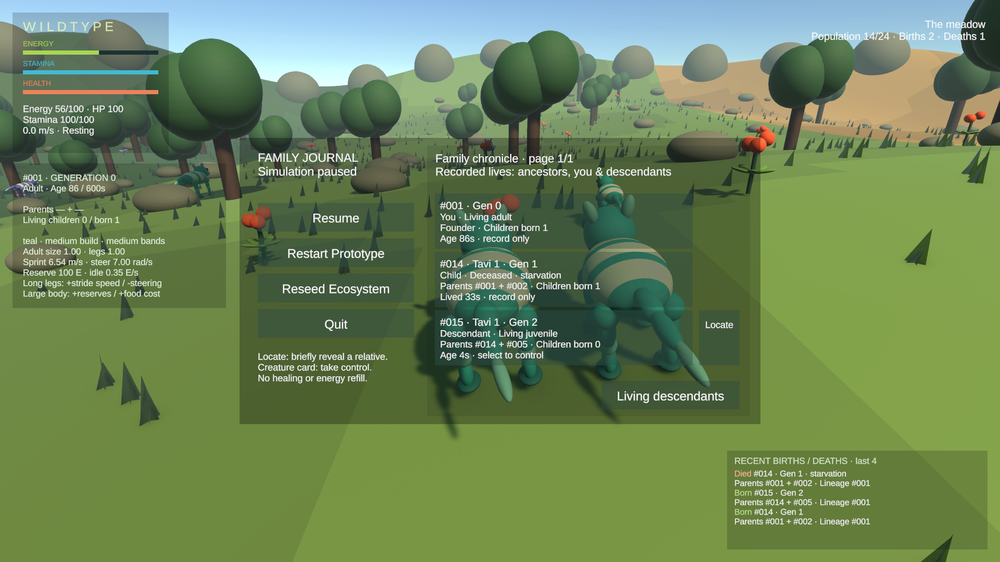
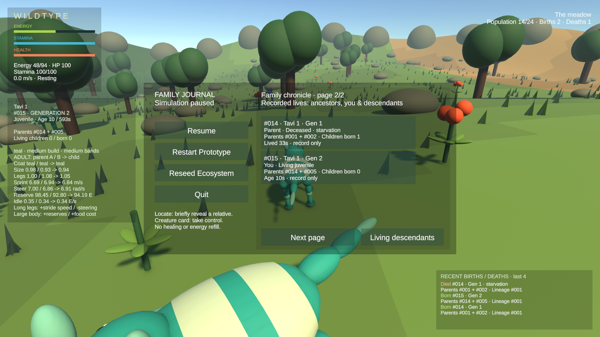

# Lineage chronicle — rendered Editor evidence

Unity 6000.4.7f1, actual local saved CreatureStage_Prototype, 1920×1080. **Assisted fixture inspection, not unaided human play:** two normal inherited births were set up by co-location/refills and accelerated growth; a deliberate food-free Vitals tick produced the child's starvation. Native clicks operated Chronicle, descendant control and Next page; native Tab reopened the journal. The helper was removed before final tests. No protected local scene/prefab/mesh was saved or changed.

## Parent's perspective

The deceased child **Tavi 1 #014, Gen 1** retains its parents, one child born, recorded starvation and lifespan after corpse cleanup. Its identically named living child **Tavi 1 #015, Gen 2** remains selectable/locatable. Stable IDs distinguish the names.

## Descendant's perspective after taking control

After clicking #015's living card, opening Tab → Chronicle and paging forward, #014 is now correctly described as its deceased **Parent**. The recorded identity, cause and lifespan did not change. Both rows are record-only here: one is deceased and the other is the currently controlled creature.

These screenshots include the user's preserved uncommitted local scene/assets; a clean clone may look different. [Full verification and limitations](../../VERIFICATION.md).
