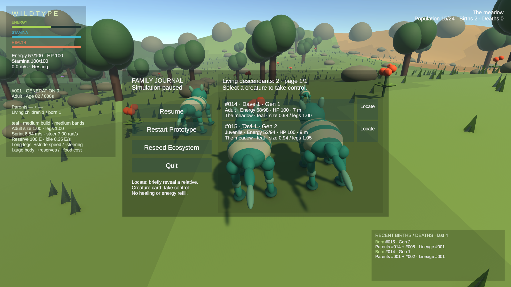
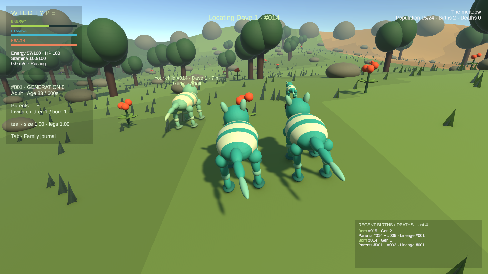
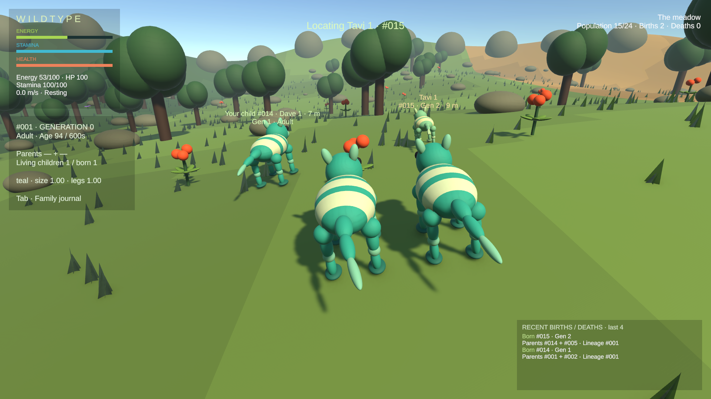
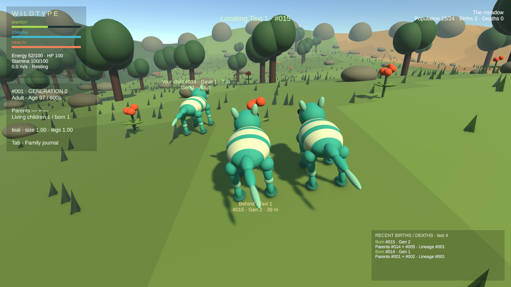

# Lineage identity and locating — running Editor evidence

Captured from the saved CreatureStage_Prototype scene in Unity 6000.4.7f1 at 1920×1080. These are **assisted inspections**, not unaided human gameplay: a temporary helper co-located/froze actors, accelerated growth, refilled two mating partners once and slowed cue capture to 0.2×. Player naming and journal Locate were clicked through the native Game view. Births used normal courtship/inheritance, including an AI-initiated grandchild birth. The helper was removed before final tests.

## Both generations are selectable

Dave 1 (#014, Gen 1) was player-named. Tavi 1 (#015, Gen 2) was named automatically at an AI birth. Both have Locate buttons, separate from taking control.

## Direct child pulse

Dave is at about 7 m on the left. His existing body and bands receive a restrained gold tint. The original #001 remains controlled.

## Grandchild pulse

Tavi is the smaller creature at about 9 m on the right. Its cue identifies the name, ID and generation; selecting it does not grant direct-child care.

## Offscreen direction

The same grandchild was placed behind the camera for this check, then Locate was clicked again. Only a compact temporary direction/name cue appears, with no camera takeover or automatic movement.

The normal effect lasts four simulation seconds. The helper slowed captures only; production does not slow time or reopen the journal automatically. See [verification notes](../../VERIFICATION.md) for tests and limitations.
