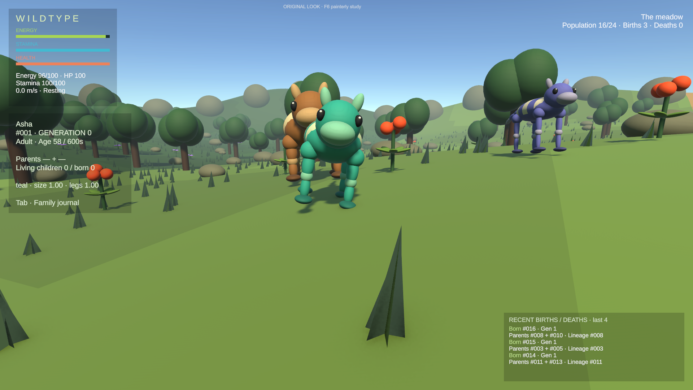
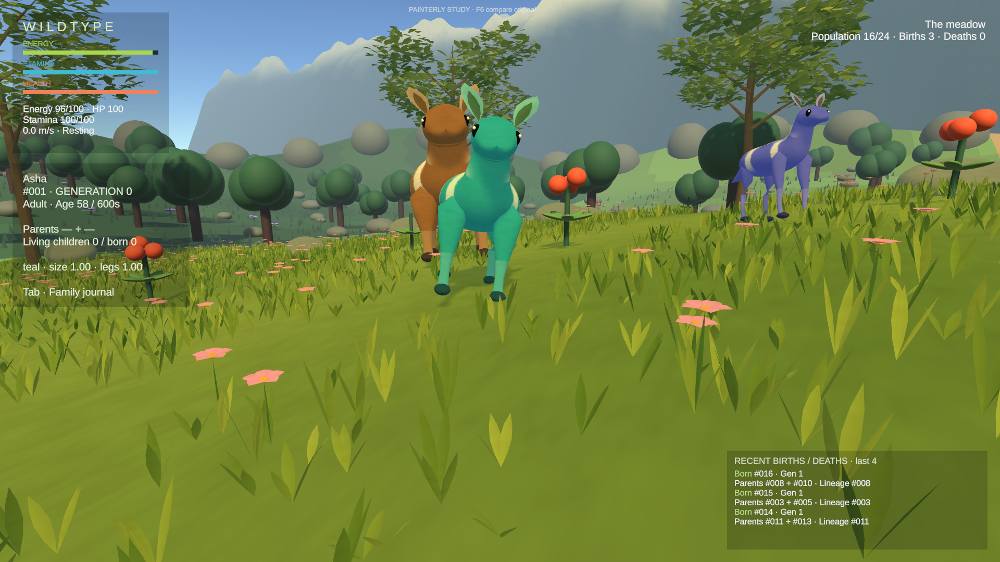
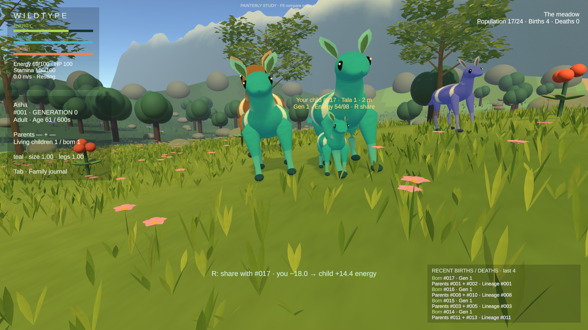
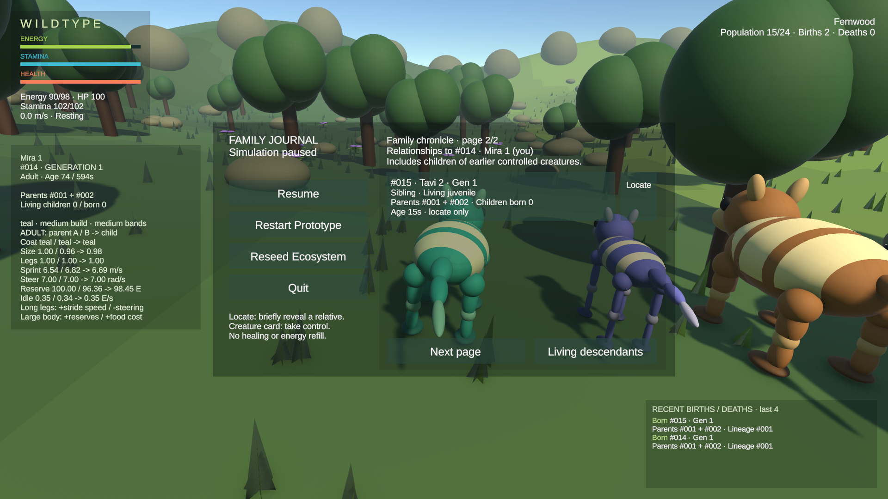
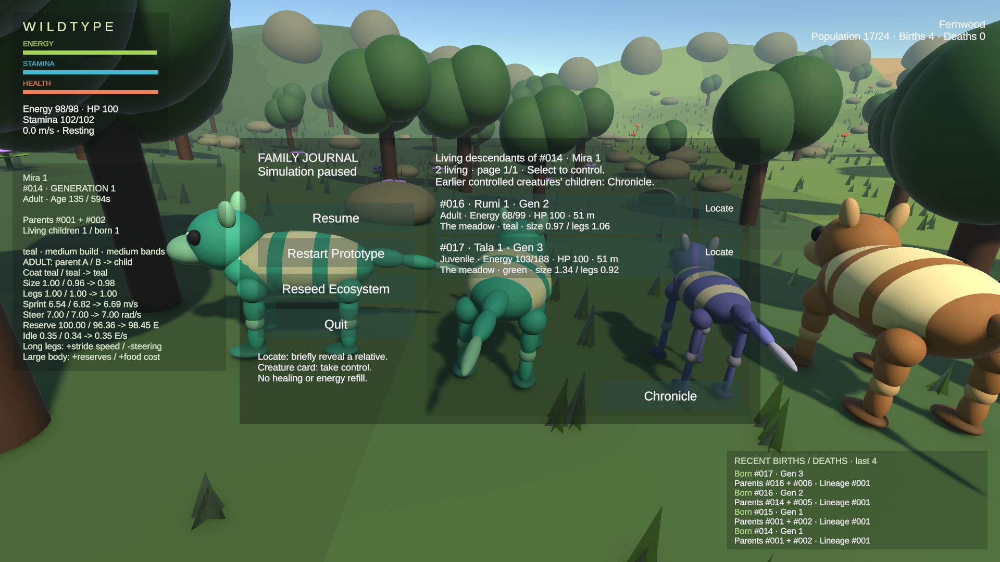

# Painterly prototype — inspection and evidence

## Scope and provenance

Started from local and pushed `milestone-lineage-continuity` **d4d77e89c0545db5552ee148bf49191d937f5c9d**. New branch: `milestone-painterly-prototype`. Main remains `d768797775ad0a7b802eaec0f50899e5d3e2e0df`; no merge or force push. The seven previously understood mesh/prefab changes are already in ancestor `4809a9d`.

All new geometry and shader work was authored procedurally in Unity. The supplied alpine reference informed palette, organic silhouette, meadow layers and atmospheric depth; it was not imported as a game texture or committed. No external assets, downloads, paid services, packages or Blender dependencies were added. The separate RunAudit project was not modified.

Open **WildType > Open painterly comparison**, press Play, and use **F6** for same-position A/B presentation. The preview is copied from the committed baseline scene, not the user's uncommitted scene. Original collision geometry and simulation systems remain shared. Only `CreatureVisual.Feeding` gained a read-only presentation accessor; no survival, genetics, controls, zoom or family rules changed.

## Comparable running views

These are unedited 1920×1080 Game-view captures, not concept renders. A temporary fixture froze simulation and positioned existing founders; camera position `(4, 3.6, -6)`, looking at `(0, 1.8, 1)`, was identical for both. This run had 16 living creatures and 72 food slots (three AI births occurred before freezing). Only the look changed.

The juvenile was produced through real mating/inheritance after assisted positioning and energy refill, with AI frozen for framing. Native Editor inspection subsequently watched that same #017 Tala 1 reach adulthood at normal simulation speed; the journal still listed it as living. The native journal Locate button resumed play and showed “Locating Tala 1 · #017”; automatic property-block tests provide the precise pulse/restoration check. Native F6 switched both ways. Brief native W/E taps did not establish successful locomotion or eating; automated motor/food checks are separate evidence, not human playtesting. No claim of an extended human-controlled foraging session is made.

## Independent lineage check before art

The actual preserved saved scene was opened and run before any art implementation. A short unassisted native-input run produced player child **#018 Sora 1, Gen 1**, parents #001/#012, through F; the newborn naming prompt appeared. At that observation: 5 total births, zero deaths, population 18. No helper was active in that first run.

A fresh, explicitly assisted saved-scene run then exercised the exact multi-generation edge case. The helper froze autonomous decisions, positioned partners, refilled their energy and accelerated normal maturity/cooldown passage by 12×. It did not edit genomes, genealogy or death records and did not kill anyone. The first three controlled births used native F; native journal clicks performed control transfer, paging and Locate. The later descendant mating was initiated by a helper call to the real mating API.

| Stable ID (seed 917430) | Parents | Final relationship to controlled #014 | Verified state/list |
|---|---|---|---|
| #001 Asha / #002 Sela | founders | Parents | Named Gen 0, alive, Chronicle |
| #014 Mira 1, Gen 1 | #001 + #002 | You | Controlled, alive; not its own descendant |
| #015 Tavi 2, Gen 1 | #001 + #002 | Sibling | Alive, Chronicle page 2, Locate enabled; not in Living descendants, no care |
| #016 Rumi 1, Gen 2 | #014 + #005 | Child | Adult with one child born, still in Living descendants and Chronicle |
| #017 Tala 1, Gen 3 | #016 + #006 | Descendant | Living juvenile, both lists; Locate eligible, no direct-child care |

Inspected both relevant Chronicle pages and the complete Living descendants page after #016 matured and reproduced. Selecting #015 Locate left control with #014 and showed an off-screen directional cue at approximately 64 m. All listed living records had registered actors, archive-alive state and no recorded death. All thirteen Gen 0 founders had readable names. No missing living descendant or new lineage defect was reproduced; no lineage repair or survival retuning was necessary.

`lineage-assisted.jsonl` records ID, parents, controller, actor registration, archive/death state and list membership. `lineage-current.json` is the final snapshot (4 births, zero deaths, 17 living). Its `care` field records biological direct-child identity, **not complete actionable juvenile-care eligibility**: adult #016 is a direct child but cannot receive juvenile care. The earlier user's vanished-child run cannot be reconstructed from this new run.

## Preserved local scene / sun experiment

Five pre-existing dirty files were copied to a recoverable local backup and SHA-256 hashed before edits. `protected-assets.json` records their exact relative paths, byte counts and hashes. Original local backup: `%TEMP%/WildTypePainterly-17330e2d/Protected`. They are excluded from this milestone's staging. Four material/preset differences normalize to the committed content; the saved original scene retains the ambiguous sun component removal documented in the previous asset review.

Isolated runtime copies of the committed-baseline preview were compared at the same frozen camera, original-look mode, with and without `UniversalAdditionalLightData` on Afternoon sun. Immediately after removing it the component was absent; eight Editor updates later URP had recreated it. The committed component used default pipeline settings (shadow resolution tier 2, rendering/shadow masks 1, unit cookie size, zero offset, default soft-shadow quality). Captures `sun-with.png` and `sun-without.png` are byte-identical: SHA-256 **9EFB85AB235887CD9A9F9B833758BDB377A8444204B242229FBE538EF1F4AE64**.

**Finding:** no visible difference in this tested URP configuration; the technical effect is an absent serialized component that the pipeline recreates on use. This is not evidence that component removal is safe under every future lighting configuration. **Recommendation for review:** restore the default additional-light-data component in a deliberate future scene cleanup. Its original intent is unknown; this milestone leaves the original scene patch intact and uncommitted. The art preview uses the committed component, not the ambiguous local patch.

## Modest performance comparison

Unity 6000.4.7f1, DX12, RTX 4070 SUPER, Editor Game view 1920×1080. Same preview scene, fixed camera, frozen 16-creature/72-food state, 60 warm-up frames then 300 unique rendered frame samples per mode. `Time.unscaledDeltaTime` measures Editor frame intervals, not isolated GPU cost. Static batching is disabled in both modes for reversible source-mesh swaps; this is **not** a benchmark against a shipping optimized build.

| Mode | Median frame interval | 95th percentile | UnityStats triangles | Draw calls |
|---|---:|---:|---:|---:|
| Original look | 3.376 ms | 3.921 ms | 4,563,520 | 2,063 |
| Painterly study | 3.029 ms | 3.550 ms | 4,604,366 | 1,627 |

The study generated 615,491 patch vertices. Fewer creature renderers offset some added foliage work in this view. These short frozen samples do not establish performance during 24 moving creatures, GPU bottlenecks, other hardware or prolonged play. The automated full-population check separately exercises the cap.

## Verification

Final complete suites: **119/119 Edit Mode and 40/40 Play Mode passed**, zero failed/skipped. Play Mode duration: 502.75 seconds. Temporary lineage/capture helpers were removed before the full suites. Added tests cover deterministic finite inherited body topology, no genome/random-state mutation, A/B restoration, unchanged colliders/resources/positions, food consumption/regrowth, painted child growth, Locate color restoration, descendant control, movement, paused restart/reseed cleanup and full-population presentation bounds. The capacity test reached 24 living painted creatures, retained 72 food slots, stayed within 32 actor objects/512 ancestry records, and rejected another mating request. Existing suites retain lineage, ecology, survival, care, ancestry and input regression coverage.

The first full Play Mode run was **37/40**. Three test issues were diagnosed rather than changing game rules: the existing invalid-care test compared energy across a yielded normal metabolic tick (0.007 energy difference), so it now samples immediately before the synchronous rejected action; the new full-capacity fixture initially paired incompatible presets, so it now asks the real eligibility flow for compatible partners; the new pulse test compared a property-block round trip to an unquantized source color, so it now verifies exact restoration against the original stored property block. The cap fixture explicitly refills energy while real cooldowns pass; it is a capacity/presentation check, not a survival-balance experiment.

Focused rerun: **4/4 passed**, including all three preview tests and the corrected existing care test. Final full suites run with no filter through Unity's `-batchmode -runTests -testPlatform EditMode` and `PlayMode`, with `-projectPath` pointing at WILDTYPE and XML/log outputs outside the project. They can also be rerun through the Editor Test Runner. Local detailed results are retained under `%TEMP%/WildTypePainterly-17330e2d`; raw Editor logs are not committed because they include machine/licensing details.

After the final suites, reopened Unity through native controls, opened the saved preview from its menu and entered Play Mode with no inspection helpers installed. The 1920×1080 Game view rendered the meadow and moving inherited forms, showed named founder Asha and the normal mating prompt, and reached 16 living creatures/3 autonomous births/0 deaths during the short observation. Console showed zero errors (the Editor's pre-existing legacy Input Manager deprecation warning appeared on startup). This was a brief unassisted rendered smoke check, not a long survival playtest.

## Provisional work / limits

- This remains a procedural visual prototype, substantially simpler and more stylized than the supplied painting. Limbs still have visible joins, grass/flowers are simple curved geometry, and ridges need stronger alpine shape/design. It is not a finished organic character or full art pipeline.
- Only the central meadow receives replacement scenery. Original geometric scenery outside it remains conspicuous by design. Boundary classification depends on this committed prototype's combined mesh layout.
- No new collision, navigation obstacles or food objects. Original food silhouettes are retained for readability. Grass clearings use initial food positions; after reseed the plants remain reachable, but clearings are not regenerated around every new food location.
- Shared shader/material and one-time meshes avoid per-frame mesh/material allocation, but each new creature still has a construction cost. Moving-population profiling, LOD and a build benchmark remain future work.
- Native inspection used the computer-use skill and assisted fixtures where identified. Automated tests are not human playtesting; gamepad, sustained native locomotion/foraging and subjective animation feel still merit player review.
